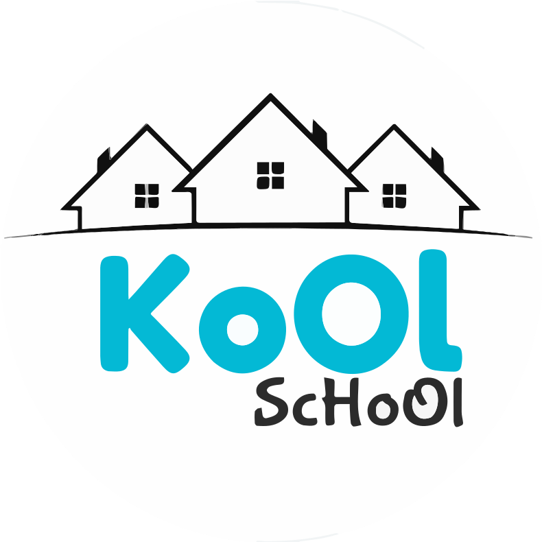

<!-- PROJECT LOGO -->
 

  
  
  <h3 align="center">KoOl ScHoOl</h3>

  

    The Next Generation School...
     
    <a href="https://docs.google.com/document/d/1q1SIUSUNruMDMqC9w2uoD2WP5j23-uSh62IM_z4Yg5k/edit?usp=sharing"><strong>Explore the docs »</strong></a>
     
    <a href="https://kool-school.vercel.app">View Demo</a>
    ·
    <a href="https://github.com/Shivani0212/KoOl_ScHoOl/issues">Report Bug</a>
    ·
    <a href="https://github.com/Shivani0212/KoOl_ScHoOl/pulls">Request Feature</a>
  

 

 

  
## Introduction: 

  
A platform that streamlines school operations and simplifies tasks, enabling seamless management and organization for enhanced productivity and efficiency of both students and teachers.
 

### The features we implemented are: 

* Secure and reliable storage of student and teacher information.
* Teachers should be able to create different classes and add various subjects to these classes.
* Head could assign teachers to these classes, and create & update the timetable of these classes.
* Head of the management can assign the role of a teacher to a user,registered students in school, and assign them in class.
* Students can participate for upcoming events,photos posted on the website to other social media.

## Built With: 
* MongoDB
* ExpressJS
* ReactJS
* NodeJS
* CSS
* Tailwind CSS

<!-- MARKDOWN LINKS & IMAGES -->
[React.js]: https://img.shields.io/badge/React-20232A?style=for-the-badge&logo=react&logoColor=61DAFB
[React-url]: https://reactjs.org/
